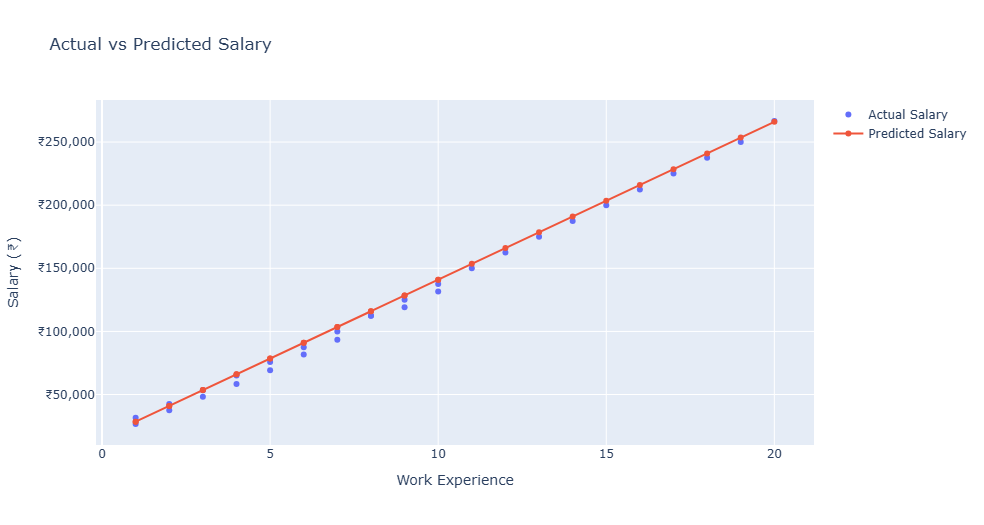

# 📈 Salary Prediction using Ordinary Least Squares (OLS) Linear Regression

Welcome to my Machine Learning project where we explore the **Ordinary Least Squares (OLS)** algorithm! This project walks through the mathematical intuition behind Linear Regression by manually calculating the line of best fit, and then transitions into using standard industry libraries (`scikit-learn`) for both Simple and Multiple Linear Regression.

## 1) What is OLS? 🧮
**Ordinary Least Squares (OLS)** is the underlying mathematical method used in Linear Regression. 

Imagine you have a scatter plot of data points (like Work Experience vs. Salary). You want to draw a straight, continuous line through these points that best captures the trend. OLS calculates the best possible line by **minimizing the sum of the squares of the differences (residuals)** between the actual data points and the predicted points on the line. 

In simple terms, for the equation of a line `y = mx + c`:
* OLS finds the perfect **slope (m)** and **intercept (c)** so that the line makes the fewest errors in prediction.

## 2) What are we building? 🛠️
In this project, we are building a progressive Salary Prediction Model in three phases:
1. **The Manual Approach:** We manually calculate a "multiplication factor" (slope) and try guessing an intercept to predict salary based purely on work experience.
2. **Simple Linear Regression (1 Feature):** We use Python's `scikit-learn` library to automatically apply OLS and find the mathematically perfect slope and intercept for Work Experience vs. Salary.
3. **Multiple Linear Regression (Multiple Features):** We upgrade our model to predict a person's salary based on multiple real-world factors: **Experience, Age, and Performance Rating**.

## 3) Key Takeaways for Beginners 💡
* **ML is just Math under the hood:** Machine Learning isn't magic. As demonstrated in Phase 1 and 2, training a model just means calculating the perfect mathematical weights (slope and intercept).
* **Why use Scikit-Learn?** Manually guessing the parameters (like `p = 12500` and `c = 16000`) is tedious and prone to error. Scikit-learn's `model.fit()` runs the OLS math instantly to give us the absolute best parameters.
* **Scaling is easy:** The true power of ML libraries is how easily you can switch from 1 independent variable (Simple Regression) to multiple independent variables (Multiple Regression) using the exact same code structure.

---

## 4) Step-by-Step Code Walkthrough 🚀

### Step 1: The Manual Approach
First, we load our dataset, sort it, and manually find the average ratio of Salary to Work Experience.

```python
import pandas as pd
import matplotlib.pyplot as plt
import plotly.express as px
import plotly.io as pio
import plotly.graph_objects as go
from sklearn.linear_model import LinearRegression
import numpy as np

# Sample Data
work_exp = [8, 2, 18, 1, 10, 5, 14, 3, 6, 2, 20, 9, 4, 16, 5, 1, 12, 7, 3, 10,
            6, 17, 4, 8, 13, 7, 15, 9, 11, 19]
salary = [112500, 42500, 237500, 26667, 137500, 69167, 187500, 53333, 87500, 37500,
          266667, 125000, 58333, 212500, 75833, 31667, 162500, 100000, 48333, 131667,
          81667, 225000, 65000, 112500, 175000, 93333, 200000, 119167, 150000, 250000]

df = pd.DataFrame({'work_exp': work_exp, 'salary': salary})

# Finding the multiplication factor manually
m = (df['salary'] / df['work_exp']).mean()
print('Manual Multiplier (m):', m)

# Predicting for 50 years of experience
x = 50
print('Predicted Salary:', x * m)
```
**Expected Output:**
```text
Predicted Salay: 772681.2931217102
```

### Step 2: Visualizing Actual vs. Predicted Salary (Manual Approach)

Now we will plot our actual data points against the predictions we made using our manual multiplier (`m`). This helps us visually check how well our manual model is performing. 

```python

# 1. Calculate the predicted salary using our manual multiplier (m)
df['predicted_salary'] = df['work_exp'] * m

# 2. Create an empty Plotly figure
fig = go.Figure()

# 3. Add the Actual Salary points (Scatter Plot / Dots)
fig.add_trace(go.Scatter(
    x=df['work_exp'],
    y=df['salary'],
    mode='markers',
    name='Actual Salary'
))

# 4. Add the Predicted Salary points (Line Plot)
fig.add_trace(go.Scatter(
    x=df['work_exp'],
    y=df['predicted_salary'],
    mode='lines+markers',
    name='Predicted Salary'
))

# 5. Add titles and format the layout
fig.update_layout(
    title='Actual vs Predicted Salary (Manual Tuning)',
    xaxis_title='Work Experience (Years)',
    yaxis_title='Salary (₹)'
)

# 6. Display the graph
fig.show()
```


**🔍 Analyzing the Output:**

If you look closely at the graph above, you will notice a clear divergence between the **Actual Salary (blue dots)** and our **Predicted Salary (orange line)**. 

* **The Good:** For employees with 1 to 5 years of experience, our manual multiplier does a fairly decent job of estimating the salary.
* **The Bad:** As work experience increases, the orange line starts to heavily over-predict. By the 20-year mark, our manual model predicts a salary over ₹300,000, while the actual data point is closer to ₹260,000. 

**Why did this happen?** Because we only calculated a simple average ratio (our slope, `m`) without accounting for a baseline starting salary (the intercept, `c`). This creates a rigid line that multiplies our errors as the numbers get bigger. 

This growing gap (known mathematically as the *residual error*) perfectly illustrates why manual calculations aren't efficient for real-world data. In the next step, we will use the **Scikit-Learn** library to automatically calculate the exact slope and intercept that reduces these errors to the absolute minimum!


### Step 3: Improving the Model Manually (Adding an Intercept)

In the previous step, we only used a slope (our multiplier, `m`). This forces our prediction line to point straight towards zero, which isn't how real-world salaries work (even with 0 years of experience, a starting salary usually exists). 

To fix this, we need to complete the equation of a straight line: `Salary = (Work Experience * p) + c`.
* `p` = Our new manual slope 
* `c` = Our manual intercept (base starting value)

Let's test this by manually guessing `p = 12500` and `c = 16000` to see if our prediction line fits the data better!

```python

# 1. Define our manual slope (p) and intercept (c)
p = 12500
c = 16000

# 2. Calculate the predicted salary using the full line equation: y = px + c
df['predicted_salary'] = (df['work_exp'] * p) + c

# 3. Create the Plotly figure
fig = go.Figure()

# 4. Add the Actual Salary points
fig.add_trace(go.Scatter(
    x=df['work_exp'],
    y=df['salary'],
    mode='markers',
    name='Actual Salary'
))

# 5. Add the Predicted Salary points
fig.add_trace(go.Scatter(
    x=df['work_exp'],
    y=df['predicted_salary'],
    mode='lines+markers',
    name='Predicted Salary'
))

# 6. Add titles and format the layout
fig.update_layout(
    title='Actual vs Predicted Salary (Manual Slope & Intercept)',
    xaxis_title='Work Experience (Years)',
    yaxis_title='Salary (₹)'
)

# 7. Display the graph
fig.show()
```


**🔍 Analyzing the Output:**

What a difference an intercept makes! If you compare this graph to the one in Step 2, the improvement is massive:

* **A Perfect Fit:** By adding the intercept (`c = 16000`), our prediction line is no longer forced to point towards zero. It now has a realistic baseline starting salary.
* **Errors Minimized:** The orange prediction line now beautifully tracks the actual blue data points across the *entire* range. That huge over-prediction gap we saw at the 20-year mark in Step 2 has completely disappeared!

This perfectly illustrates the power of the complete algebraic equation for a line: `y = mx + c`. 

**The Catch:** While our line looks great, we still just "guessed" the numbers `p = 12500` and `c = 16000`. Guessing works for simple datasets, but it is impossible for massive datasets with millions of rows. 

In **Step 4**, we will stop guessing and use the **Scikit-Learn** Machine Learning library to mathematically calculate the absolute perfect OLS parameters in a fraction of a second!


### Step 4: Machine Learning in Action (Scikit-Learn OLS)

Manual guessing is a great way to understand the underlying math, but what if we had 3 million rows of employee data instead of 30? We can't sit around guessing numbers all day! 

This is where actual Machine Learning comes in. We will use the industry-standard `scikit-learn` library to mathematically calculate the *absolute perfect* slope and intercept in a fraction of a second.

```python

# 1. Prepare the data for OLS
# Scikit-learn requires the independent variable (X) to be a 2D array
X = df['work_exp'].values.reshape(-1, 1) 
y = df['salary'].values

# 2. Create and train (fit) the OLS model
model = LinearRegression()
model.fit(X, y)

# 3. Extract the mathematically perfect slope (p) and intercept (c)
p_ols = model.coef_[0]
c_ols = model.intercept_

print(f"OLS Slope (p): {p_ols}")
print(f"OLS Intercept (c): {c_ols}")

# 4. Plotting the optimized Sklearn prediction
df['predicted_salary'] = (df['work_exp'] * p_ols) + c_ols

fig = go.Figure()
fig.add_trace(go.Scatter(x=df['work_exp'], y=df['salary'], mode='markers', name='Actual Salary'))
fig.add_trace(go.Scatter(x=df['work_exp'], y=df['predicted_salary'], mode='lines+markers', name='Predicted Salary (Scikit-Learn)'))

fig.update_layout(title='Actual vs Predicted Salary (Scikit-Learn OLS)', xaxis_title='Work Experience (Years)', yaxis_title='Salary (₹)')
fig.show()
```
**Expected Output:**
```text
OLS Slope (p): 12484.203828623518
OLS Intercept (c): 12250.666180492248
```


**🔍 Analyzing the Output:**

This graph represents the mathematical peak of our Simple Linear Regression model! Let's break down why this is the true "Line of Best Fit":

* **The Mathematical Perfect Fit:** Unlike our manual guesses in Step 3, the `scikit-learn` algorithm calculated the exact slope (**`12484.20`**) and intercept (**`12250.66`**) needed to minimize the "Sum of Squared Residuals". This is the core mathematical engine behind Ordinary Least Squares (OLS).
* **Visual Confirmation:** Look at how the orange prediction line perfectly threads the needle through the blue actual data points. It balances the slight over-predictions (where dots are below the line) with the slight under-predictions (where dots are above the line) to create the lowest possible overall error margin.
* **The Power of ML Libraries:** We achieved this perfect fit with just three simple lines of code (`model = LinearRegression()`, `model.fit(X, y)`, and `model.predict(X)`). 

Now that we have mastered predicting salary using just *one* variable (Work Experience), it's time to level up. In the final step, we will use this exact same logic to predict salary using *multiple* variables at once!

### Step 5: Leveling Up to Multiple Linear Regression

In the real world, a person's salary isn't just based on how many years they've worked. It also depends on their age, their performance rating, their education, and more. 

When we use more than one independent variable to predict our target outcome, it is called **Multiple Linear Regression**. The true beauty of the `scikit-learn` library is that scaling our model from 1 feature to 3 features requires almost zero changes to our code!

Let's train a final model that predicts Salary based on three distinct features: **Experience, Age, and Rating**.

```python
# Sample dataset with multiple independent variables
data = {
    'experience': [1, 2, 3, 4, 5, 6, 7, 8, 9, 10],
    'age': [22, 24, 25, 27, 29, 31, 32, 35, 37, 40],
    'rating': [2, 3, 3, 4, 4, 5, 5, 6, 6, 7],
    'salary': [30000, 40000, 50000, 60000, 75000, 85000, 95000, 110000, 120000, 135000]
}

# Create dataframe
df = pd.DataFrame(data)

# Independent variables (X) and Dependent variable (y)
X = df[['experience', 'age', 'rating']]
y = df['salary']

# Create and train the Multiple Linear Regression model
model = LinearRegression()
model.fit(X, y)

# Predict salaries for our existing dataset
df['predicted_salary'] = model.predict(X)

# Print the calculated mathematical weights
print("Intercept:", model.intercept_)
print("\nCoefficients:")
for feature, coef in zip(X.columns, model.coef_):
    print(f"{feature}: {coef}")

# Model accuracy (R-squared)
r2 = model.score(X, y)
print("\nR-squared Accuracy:", round(r2, 4))

# Predict salary for a brand new employee
new_employee = [[6, 30, 5]]
prediction = model.predict(new_employee)
print("\nPredicted Salary for new employee: ₹", round(prediction[0], 2))

# Plot Actual vs Predicted
fig = go.Figure()
fig.add_trace(go.Scatter(x=df.index, y=df['salary'], mode='lines+markers', name='Actual Salary'))
fig.add_trace(go.Scatter(x=df.index, y=df['predicted_salary'], mode='lines+markers', name='Predicted Salary'))

fig.update_layout(title='Actual vs Predicted Salary (Multiple Features)', xaxis_title='Employee Index', yaxis_title='Salary (₹)')
fig.show()
```
**Expected Output:**
```text
Intercept: -35836.36363636362

Coefficients:
experience: 7163.636363636368
age: 2818.1818181818153
rating: -1927.2727272727202

R-squared Accuracy: 0.9994

Predicted Salary for new employee: ₹ 82054.55
```


**🔍 Analyzing the Final Graph:**

Take a close look at the graph above. This is the visual proof of our Multiple Linear Regression model's true power!

* **Near-Perfect Alignment:** Notice how the **Predicted Salary (orange line)** traces over the **Actual Salary (blue line)** almost perfectly. Unlike our simple 1-feature model where a single straight line had to balance between scattered dots, this model tightly hugs every single data point.
* **The Power of Multiple Features:** Why is the fit so much better? Because we gave the model more context! By feeding it Experience, Age, *and* Rating, the algorithm was able to calculate the nuanced mathematical weights of each factor, rather than relying on just one simple trend.
* **Visualizing 99.94% Accuracy:** If you look very closely, you can see tiny, barely visible gaps between the blue and orange dots (like at Employee Index 3 or 7). These tiny gaps represent the remaining 0.06% of variance. This graph perfectly illustrates what an R-squared score of 0.9994 looks like in reality.

**Congratulations!** 🎉 You have successfully built, tuned, and visualized Machine Learning models—starting from manual mathematical guesses all the way to a highly accurate Scikit-Learn Multiple Linear Regression model!
